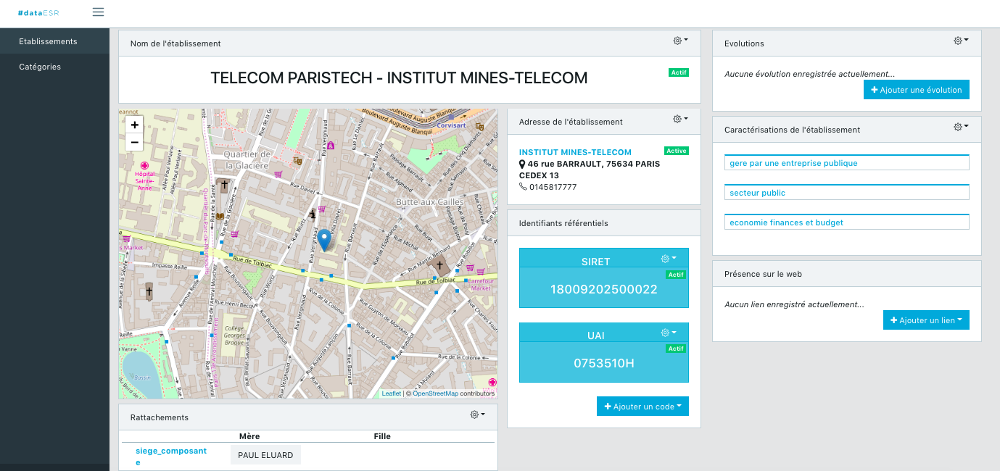

# DataESR 


DataESR gathers data about higher education and research to provide the most accurate and updated information for users.

## Front-end

This repository contains the Front-end code for data adminstration and management.



It is based on the [CoreUI Free Bootstrap Admin Template](https://coreui.io/react/) for **React** framework. The architecure of the repository remain more or less the same :

```
.
├── public
│   └── img
|       └── index.html
├── scss                        # Styles included with the original template
    ├── core
│   └── vendors
├── src                         # Application source code
│   ├── components              # Side components included with the original template (Footer, Header, Sidebar, ...)
│   ├── containers              # Component for the main page, redirect to the requested view (routing) the routing management
│   │   └── Full
│   ├── views                   # Components that appear on the pages of the app
        ├── Category            # For the categories management
        ├── Etablissements      # For the institutions
            ├── Address         # Address block of an institution's page
            ├── Code            # Code block (UAI, Grid, ...) of an institution's page
            ├── Connection      # Relations between institutions visible on an institution's page
            ├── Evolution       # Evolution of an instution (mergers, splittings)
            ├── Link            # Link to display (institution's website, youtube page, ...)
            ├── Name            # Name block of an institution's page
            ├── Tag             # Tags related to an instutions (private, public, ...)
        ├── Pages               # Register and error pages that come with the template and are not being used yet
        ├── authentification.js # Store authentification token in local storage
        ├── index.js            # Contains the route to pages
│   │   └── PrivateRoute.js     # Authentified routes
├── LICENSE
├── package.json
├── readme.md
├── webpack.config.js
```

## Back-end *[To be completed]*

The Back-end is made up of micro-services that you all need to install locally to connect with the front-end :
- institution
- authentification
- conflict


## Installation

You need to have **Node (v8.9.4)** on your local development machine

- Clone down the repository:

    `git clone https://github.com/ambreelmee/data-esr.git && cd data-esr`

- Update dependencies:

    `npm install`

- Launch:

    `npm start` and go to http://localhost:8080/
